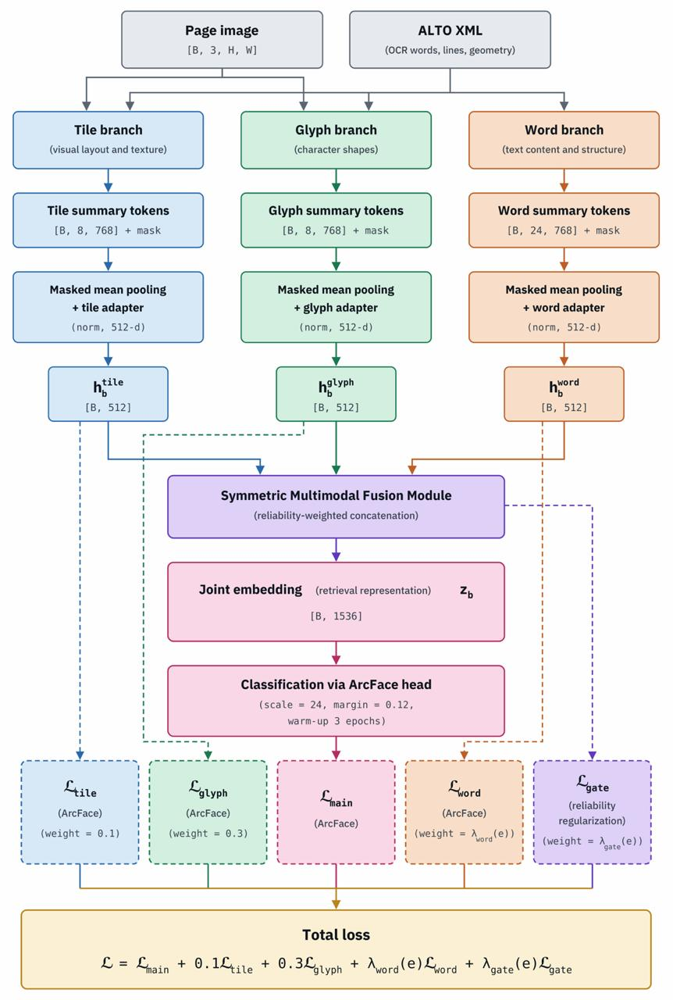

# JoinFinder

JoinFinder is a PyTorch research codebase for identifying likely joins between
ancient manuscript fragments. In this project it was applied to the Cairo Geniza
dataset, but the same pipeline can be applied to any manuscript collection you
want to cluster, as long as page images and OCR/XML input are available in the
relevant ALTO mode. It learns page-level representations from manuscript images
and ALTO/XML metadata, then uses those representations for manuscript
classification, fragment projection, nearest-neighbor search, and graph-based
join analysis.

The model is intentionally multimodal. A page is represented through visual text
tiles, OCR-derived glyph crops, and optional OCR word/line features. These streams
are encoded separately, fused into a shared latent space, supervised during
training with manuscript labels, and reused after training to compare manuscript
fragments at scale.

## Architecture



At a high level, JoinFinder turns each manuscript page into padded modality token
sets:

- Text-focused page tiles capture local visual layout, parchment, ink, and script
  texture.
- Glyph crops capture character-level handwriting evidence from ALTO character
  boxes.
- OCR words and lines provide a textual/context stream when enabled.
- A fusion module combines the available modalities into a retrieval embedding
  used for classification during training and KNN search during fragment
  analysis.

## Comparison Results

| Model | Best variation | Input mode | mAP | Hit@1 | Hit@5 | Hit@10 |
|---|---|---|---:|---:|---:|---:|
| SIFT | Frozen RootSIFT | TextBlock polygon | 0.25 | 0.29 | 0.43 | 0.51 |
| ConvNeXt-Tiny | CE-trained | Naive center crop | 0.28 | 0.35 | 0.47 | 0.54 |
| DINOv2 ViT-B/14 | Frozen CLS | Naive center crop | 0.32 | 0.38 | 0.54 | 0.61 |
| AlephBERT OCR<sup>&dagger;</sup> | Frozen OCR encoding | OCR text only | 0.23 | 0.22 | 0.40 | 0.54 |
| NeoMME-800M | Separate image/OCR + concat. | TextBlock polygon + OCR | 0.19 | 0.20 | 0.38 | 0.46 |
| GME-Qwen2-VL-2B | Native joint image/OCR | TextBlock polygon + OCR | 0.20 | 0.18 | 0.40 | 0.52 |
| **JoinFinder** | **Proposed model** | **Tiles + glyphs + OCR** | **0.46** | **0.56** | **0.68** | **0.73** |

## Run The Main Process

Run commands from the repository root. Training is driven by `main.py`, with
configuration loaded from `config/*.json` through `system.py`.

Stage 1 from scratch:

```bash
python main.py --stage stage1 --init scratch
```

Stage 2 from a checkpoint:

```bash
python main.py \
  --stage stage2 \
  --init checkpoint \
  --checkpoint Results/best_model/example.pth
```

Common training overrides:

- `--table <table>` selects a DB table instead of the stage default.
- `--xml_base_path <path>` provides an XML fallback root for rows missing
  `xml_path`.
- `--num_epochs <n>` overrides the configured epoch count.
- `--geniza none`, `--geniza classification`, or `--geniza contrastive` controls
  whether the auxiliary manuscript collection configured in `system.py` is
  excluded, merged into classification training, or used through the contrastive
  objective.

## Cluster A Manuscript Collection

To cluster manuscripts with a trained checkpoint:

1. Prepare rows for the target collection with image paths, XML paths, and stable
   manuscript or collection identifiers.
2. Make sure the OCR/XML parser settings match the collection's ALTO mode. For a
   collection with different OCR confidence behavior or dictionary coverage, use
   the relevant config switches or the comparison script's
   `--relaxed-alto-filters` option.
3. Project the target pages into model latents.
4. Recompute search vectors, run nearest-neighbor search, then analyze the
   resulting graph or pair scores.

The projection and neighbor scripts read their source, latent, and output table
settings from `system.py`. For a different manuscript collection, point those
settings at that collection's metadata table, latent table, image/XML roots, and
neighbor output tables before running the pipeline. The historical table
constants include names such as `GENIZA_IMAGE_LATENTS_TABLE`,
`GENIZA_KNN_RESULTS_TABLE`, and `GENIZA_OVERALL_NEIGHBORS_TABLE`.

```bash
python aftertune/project_geniza_to_latent.py \
  --checkpoint Results/best_model/example.pth

python aftertune/recompute_geniza_pca.py

python aftertune/geniza_top_neighbors_gpu.py
```

## Run The Comparison Test

The main pairwise evaluation script is
`results_analysis/test_set/compare_clusters_pairs.py`. It compares all image
pairs in a cluster metadata CSV/XLSX file and writes pair scores plus retrieval
metrics.

```bash
python results_analysis/test_set/compare_clusters_pairs.py \
  results_analysis/test_set/clusters_images_metadata.csv \
  --checkpoint Results/best_model/example.pth \
  --output results_analysis/test_set/clusters_images_metadata_pairs.xlsx
```

If the images were already projected to the DB latent table, omit
`--checkpoint` and the script will read existing vectors:

```bash
python results_analysis/test_set/compare_clusters_pairs.py \
  results_analysis/test_set/clusters_images_metadata.csv
```

For a new manuscript collection, provide a metadata file with the same required
columns, including `image_path`, `xml_path`, and `cluster_id`, and switch the
OCR/ALTO configuration to match that collection. `--relaxed-alto-filters` is
available when evaluating a checkpoint on OCR that should not use the default
dictionary and confidence filters.

## Implementation Details

### DB Row To Dataset Item

`main.py` and `aftertune/project_geniza_to_latent.py` both build datasets from DB
rows. The minimum useful row has `image_path`; XML-driven behavior needs
`xml_path` or a path that can be resolved by `utilities/xml_loader.py`.

For supervised training the row also has a task label, usually `manuscript_id`,
and preferably `dataset_split`. `train/split_data.py` uses `dataset_split` when it
exists. For manuscript-ID classification, manuscript IDs may appear in multiple
splits because the split is page-level; exact image-path overlap is still rejected.
For non-manuscript-ID label heads, manuscript overlap across splits is treated as
leakage.

### Visual Tile Stream

The visual stream starts from the full-resolution RGB page. The current default is
`PATCH_LOADING_METHOD = "extract"`, so `train/dataset.py` calls
`utilities/VisionModule/xml_patch_extraction.py` instead of using precomputed DB
tile coordinates.

Current tile extraction behavior:

- Tile size is `TILE_SIZE = 560`.
- Train/eval tile caps are `MAX_TILES_TRAIN = 8` and `MAX_TILES_EVAL = 8`.
- ALTO text regions are used to propose text-focused tile centers.
- Optional page-rotation correction is enabled by config.
- Reading order is right-to-left aware.
- Candidates are filtered/ranked by text coverage and ink density so mostly blank
  parchment/background tiles are avoided.
- `TILES_FALLBACK_GRID = True` by default, so XML extraction can fall back to
  center/grid tiles when XML-guided candidates are unavailable.
- Set `TILES_FALLBACK_GRID = False` to make XML extraction return an empty visual
  stream instead of background/grid tiles when no tile candidates are found, XML
  is missing, or XML extraction fails.

Tile augmentations are applied to individual tile crops, not to the whole page.
Train-time tile augmentation uses an 80% apply gate. When the gate fires, a
normalized weighted one-of PIL transform is selected from color jitter,
grayscale, blur, random library/background overlay, parchment stains,
white-background cleanup, local texture, tone/contrast, tilt, border crop, zoom,
resolution jitter, and RandAugment. After that, tiles are converted to tensors,
optionally random erased, and ImageNet-normalized. Eval/projection uses only
tensor conversion and normalization.

### Glyph Stream

The glyph stream also starts from the page image plus ALTO XML. The dataset calls
`utilities/VisionModule/xml_character_extraction.py` to crop individual glyphs.
The current default keeps middle letters only where configured, tightens boxes to
ink, and then uses `models.glyph_branch.GlyphHardQualityFilter`.

Current glyph behavior:

- Glyph crop size is `CHAR_PATCH_SIZE = 128`.
- Selected glyph classes are configured in `config/` and `system.py`.
- Max glyphs per image is `MAX_CHARS_PER_IMAGE = 16`: 8 fixed slots per class.
- Eight learned glyph-summary queries attend to the valid encoder tokens.
- OCR glyph confidence threshold is `OCR_GLYPH_CONFIDENCE_THRESHOLD = 0.92`.
- Filtering removes tiny glyphs, very narrow/short glyphs, extreme aspect ratios,
  low-confidence glyphs, and nearly blank crops.
- Sampling prefers diverse character classes while keeping high-confidence
  glyphs.
- Collate emits `glyph_coords` as normalized `(x, y, w, h)`, `char_class_ids`,
  `glyph_page_segments`, and `glyph_valid_mask`.

Train-time glyph augmentation is separate from tile augmentation because glyph
crops are much smaller. It also uses an 80% apply gate and normalized
glyph-specific weights for color jitter, grayscale, blur, random library
background, parchment stains, white-background cleanup, local texture,
tone/contrast, tilt, border crop, zoom, and optional RandAugment before tensor
conversion, optional erasing, and normalization.

### Word Stream

The word stream is enabled through `modalities.use_word = true`.
`utilities/ContextModule` extracts ALTO words, applies confidence and dictionary
checks, groups words by line, and uses the OCR word branch to produce line/word
tokens.

### Padding And Masks

A page can have zero, few, or many extracted tiles/glyphs/words. The model never
receives ragged tensors directly. `tile_collate_with_padding` pads every batch to
the max count in that batch and creates masks:

- `tile_valid_mask`: true for real visual tiles, false for tile padding.
- `char_valid_mask` / `glyph_valid_mask`: true for real glyph crops, false for
  glyph padding.
- `word_valid_mask`: created in the word branch when words are enabled.

If a whole batch has no valid tiles or glyphs, collate creates one dummy token with
a false mask. This avoids zero-sized tensors that can crash DataLoader pin-memory
or CUDA paths while preserving the semantic meaning: no real token exists.

### Model Forward Pass

`models.MultiModal` receives already-extracted tensors and masks. It does not open
files or parse XML.

Current default architecture:

- Tile branch: ConvNeXt tile backbone, projection to `D_MODEL = 768`, positional
  enrichment, tile-set Transformer, and 8 learned summary queries.
- Glyph branch: ConvNeXt Tiny glyph encoder, glyph coordinate/class enrichment,
  and 8 learned summary queries.
- Word branch: OCR-backed line/word tokens and 24 learned summary queries.
- Fusion: symmetric retrieval fusion by default. Optional alternatives are
  Transformer, Perceiver, and VLAD-style residual aggregation.
- Head: symmetric fusion mask-mean-pools each summary set, projects each pooled
  branch from 768 to 512 dimensions, and exports their concatenation as a
  `LATENT_DIM = 1536` retrieval vector while producing classification logits.

During training only, `MultiModal.forward` can randomly drop whole modalities
(`modality_dropout`) and randomly reduce valid tokens (`token_subsample`). These
regularizers make the page representation less brittle when target fragments have
different numbers of tiles or glyphs than training pages.

With summarization enabled, source masks have two distinct roles: they exclude
padded inputs from query attention, and their valid-source fraction is passed to
the symmetric reliability scorer. They do not deactivate individual learned
summary queries for a nonempty modality.

Fusion is selected by `config/model_architecture.json` through `fusion.method`:

- `transformer`: concatenates tile, glyph, and optional word/line tokens,
  adds modality-type embeddings, prepends a learned CLS token, and runs a
  Transformer encoder. The CLS output is the page representation.
- `perceiver`: uses learned latent queries that cross-attend to all modality
  tokens, then pools the latent set.
- `vlad`: uses the tile/glyph/word tokens as local descriptors, softly assigns
  each valid token to learned cluster centers, accumulates residuals to those
  centers, normalizes the VLAD vector, and projects it back to one
  `D_MODEL`-dimensional page token before the shared head.


### Training Goal

Training supervises the page representation with the configured `tasks/label_heads`
target. The default target is manuscript ID. The current loss configuration uses
ArcFace as the main classification objective, with tile and glyph auxiliary losses
enabled and CE disabled. The result is a checkpoint whose latent space should place
visually/textually similar manuscript pages near each other.

### Clustering Goal

Clustering starts after training. `aftertune/project_geniza_to_latent.py` reuses
the same dataset and model pipeline, but calls `model.forward_features(...)` to
store one latent vector per target manuscript image in
`GENIZA_IMAGE_LATENTS_TABLE`. Then:

1. `aftertune/recompute_geniza_pca.py` refreshes `latent_vector_search`.
2. `aftertune/geniza_top_neighbors_gpu.py` computes cosine nearest neighbors.
3. Neighbor rows are written to:
   - `GENIZA_KNN_RESULTS_TABLE`: other-manuscript neighbors.
   - `GENIZA_OVERALL_NEIGHBORS_TABLE`: all neighbors including same manuscript.
4. `results_analysis/clusters` builds manuscript/image graphs from those neighbor
   tables. Manuscript-level graph edges aggregate image-neighbor evidence between
   manuscript IDs; image-level graphs show direct page/fragment similarity.

## Operational Workflows

This is the current end-to-end workflow. Later agents should treat this section
as the first place to check before changing scripts, table names, or output
contracts.

```text
External DB + NAS images + ALTO/XML files
        |
        v
main.py
  - load config through system.py
  - select stage/table/init/checkpoint
  - build DB-backed train/val/test splits
        |
        v
train/dataset.py + utilities/
  - load image_path/xml_path rows
  - extract XML-guided visual tiles
  - extract/filter glyph crops
  - optionally extract words
  - apply augmentations and collate padded tensors
        |
        v
models/ + losses/ + train/trainer.py
  - encode tile/glyph/optional word streams
  - fuse modality tokens
  - train manuscript/dating label head
  - save checkpoints and diagnostics under Results/
        |
        v
aftertune/
  - load checkpoint
  - project images into latent vectors
  - recompute PCA/search vectors
  - compute KNN/overall neighbors
        |
        v
results_analysis/ + Debugs/
  - inspect neighbor tables
  - build graph views
  - diagnose failure cases, extraction quality, and background leakage
```

### Workflow 1: Prepare Training Tables

Purpose: create or refresh DB tables that `main.py` can train from.

Inputs:

- `db_config.ini` with PostgreSQL credentials.
- NAS manuscript images under the roots configured in `system.py`.
- ALTO/XML roots or `xml_path` values in DB rows.
- `preprocess/finetune/OrientalManuscripts.txt` and generated
  `preprocess/colored_image_paths.xlsx`.

Main output:

- DB table named by `system.STAGE1_TABLE_NAME` / `system.STAGE2_TABLE_NAME`.
- Current default table:
  `pretrain_finetune_oriental_non_oriental_train_val_test_split`.
- Rows should contain image identifiers, `image_path`, `xml_path` when available,
  manuscript labels, and preferably `dataset_split`.

Handoff to the next step: `main.py --stage stage1` or `main.py --stage stage2`
reads this classification table through `train/db_loader.py` and
`train/split_data.py`.

### Workflow 2: Train A Model

Purpose: train the multimodal model for manuscript classification or another
configured label head.

Inputs:

- Config fragments in `config/*.json`, loaded through `system.py`.
- Classification DB table selected by `--stage` or `--table`.
- Image and XML paths reachable from this machine.
- Optional checkpoint if `--init checkpoint` is used.

Stage 1 from scratch:

```bash
python main.py --stage stage1 --init scratch
```

Stage 2 from a checkpoint:

```bash
python main.py \
  --stage stage2 \
  --init checkpoint \
  --checkpoint Results/best_model/example.pth
```

### Workflow 3: Project Manuscript Images To Latents

Purpose: run a trained checkpoint over the target manuscript images and store one
latent vector per image in the configured latent table.

Command:

```bash
python aftertune/project_geniza_to_latent.py \
  --checkpoint Results/best_model/example.pth
```

Multi-GPU launcher:

```bash
python aftertune/launch_project_geniza_multi_gpu.py \
  --checkpoint Results/best_model/example.pth
```

Main output:

- `latent_vector`: full model latent.
- `latent_vector_search`: search/PCA vector, normally refreshed by the PCA step.
- Feature counts such as visual tile, glyph, and word counts.

### Workflow 4: Recompute Search Vectors

Purpose: refresh the lower-dimensional search vector used by KNN.

Command:

```bash
python aftertune/recompute_geniza_pca.py
```

Main output:

- Updated `latent_vector_search` values in `GENIZA_IMAGE_LATENTS_TABLE`.

Handoff to the next step: KNN reads either `latent_vector_search` or the full
latent vector, depending on script options/defaults.

### Workflow 5: Compute Manuscript Neighbors

Purpose: compute nearest-neighbor tables from stored manuscript vectors.

Command:

```bash
python aftertune/geniza_top_neighbors_gpu.py
```

What it writes:

- `system.GENIZA_KNN_RESULTS_TABLE`: other-manuscript neighbors only.
- `system.GENIZA_OVERALL_NEIGHBORS_TABLE`: all neighbors, including same
  manuscript.

Handoff to the next step: analysis scripts in `results_analysis/` and diagnostics
in `Debugs/impact_analysis/` read these tables.

### Workflow 6: Analyze Results And Diagnose Failures

Purpose: inspect DB coverage, graph structure, pair scores, branch behavior, and
failure cases.

Common commands:

```bash
python results_analysis/test_set/report_db_coverage_stats.py

python -m results_analysis.clusters.geniza_manuscript_graph \
  --min_similarity 0.7 \
  --min_ms_edge_weight 5 \
  --interactive_ms_html manuscript_graph.html

python Debugs/TestResultsDebug/analyze_test_results_errors.py

python Debugs/Augmentations/sample_geniza_fragment_and_visualize_augmentations.py --random
```

Main outputs:

- CSV/XLSX metrics and graph HTML under `results_analysis/`.
- Diagnostic plots/reports under `Debugs/**/outputs/`.
- Local debug logs under `logs/`.

Generated analysis outputs are snapshots. Reusable logic should stay in Python
modules, not in generated HTML or output folders.
